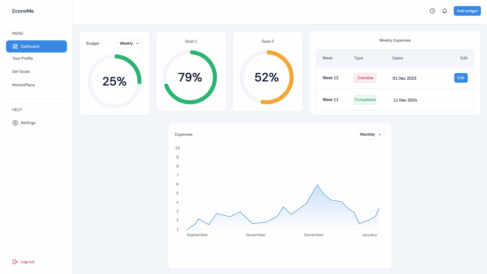
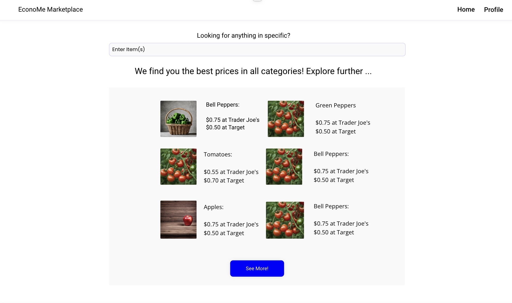
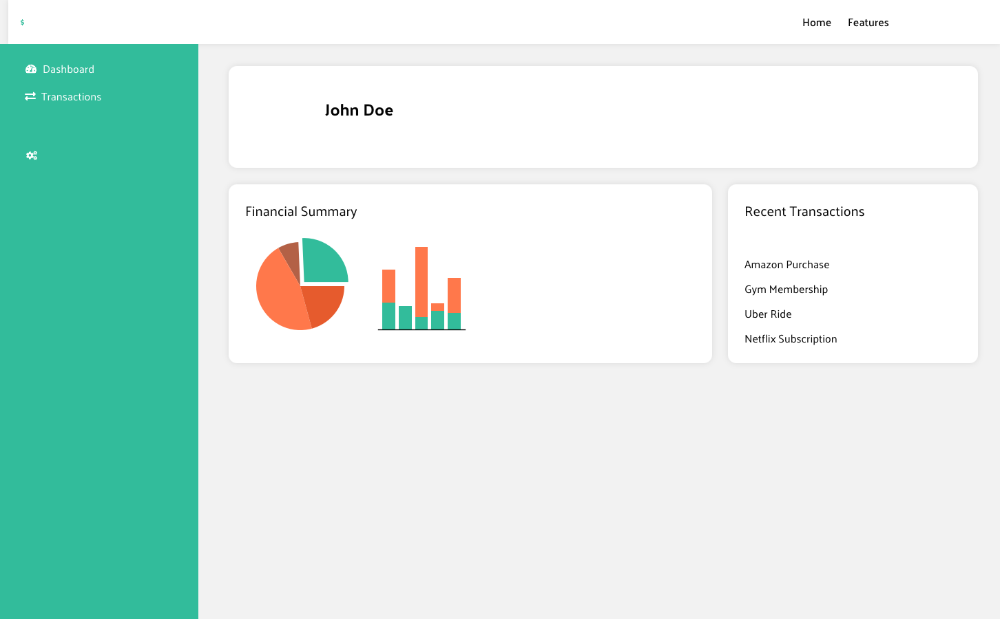
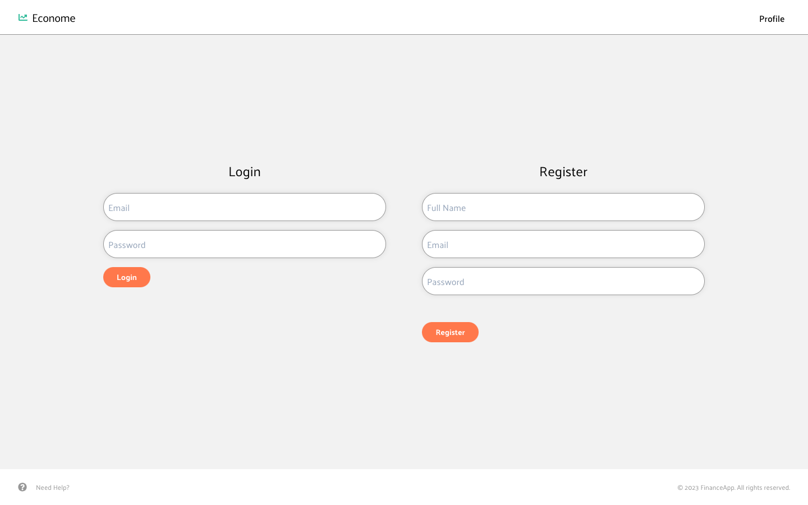

# EconoMe - React Financial Dashboard

### Project Description

EconoMe is a financial management dashboard built using React. This application provides users with a clean and organized interface to view their financial summary, manage expenses, and set personal goals. The sidebar navigation allows users to switch between the Dashboard, Profile, Marketplace, and Settings sections, each presenting different functionalities and insights.

---

### Wireframes
Dashboard Wireframe:

Marketplace Wireframe:

Profile Wireframe:

Landing Page Wireframe:

---

### Component Documentation

Below is a breakdown of each component in the EconoMe project.

1. **App.js**:  
   - **Functionality**: This is the main component that controls navigation across the app’s primary pages (Dashboard, Profile, GoalSetting).
   - **State**: `useState` is used to manage the `currentPage`, determining which page is displayed based on the sidebar selections.
   
2. **Dashboard.js**:
   - **Functionality**: This component displays the main dashboard view, including financial summaries, goal tracking, weekly expenses, and a sidebar for navigation.
   - **Props**: `navigateTo` is passed down from `App.js` to allow users to switch between different pages.
   
3. **Profile.js**:
   - **Functionality**: Shows user profile information, including name, email, membership details, and a summary of financial stats.
   
4. **GoalSetting.js**:
   - **Functionality**: Allows users to set and track financial goals.
   
5. **Sidebar (part of Dashboard.js)**:
   - **Functionality**: Provides navigation to different parts of the app. Users can click options to navigate to the Dashboard, Profile, Marketplace, or Settings.

---

### Setup Instructions

Follow these instructions to set up the EconoMe project locally.

1. **Clone the Repository**:
   ```bash
   git clone https://github.com/nayalafifi/economeReact.git
   cd economeReact
   ```

2. **Install Dependencies**:
   ```bash
   npm install
   ```

3. **Start the Development Server**:
   ```bash
   npm start
   ```
   This will start the React development server. Open [http://localhost:3000](http://localhost:3000) in your browser to view the app.

4. **Build the App for Production**:
   To create a production build, run:
   ```bash
   npm run build
   ```
   This will generate a `build` folder with optimized files for deployment.

---

### Development Process

#### Design Decisions

1. **Navigation with State Management**:
   - Instead of using a routing library like React Router, we opted for a simple `useState` approach to manage page navigation. This was chosen to keep the project lightweight and straightforward for educational purposes.
   
2. **Component Structure**:
   - Each major section of the app (Dashboard, Profile, GoalSetting) is separated into its own component. This modular approach improves readability and maintainability, allowing each section to be developed and tested independently.

3. **Styling and Layout**:
   - CSS files are used for styling each component (`App.css`, `dashboard.css`, etc.). This keeps component-specific styles separate, enhancing maintainability and making it easy to find and modify specific styles.

#### Technical Choices

1. **React**:
   - React was chosen for its component-based architecture, which makes it easy to build and manage each section of the dashboard independently.
   
2. **CSS Modules**:
   - Separate CSS files for each component help in managing styles in a modular way, making sure styles don’t clash across components.

3. **State Management with `useState`**:
   - The simple state management solution with `useState` is sufficient for this project, given the minimal navigation requirements. If the project were to expand, using a library like Redux or React Context could be considered.

#### AI Usage

1. **Component Structure and State Management**:
   - AI assistance was used to outline the structure of the components and to simplify state management for navigation between the different sections of the app. 
   
2. **Styling and Design Suggestions**:
   - AI was also used to provide suggestions on the layout and organization of CSS classes to ensure the design is consistent and visually appealing.

